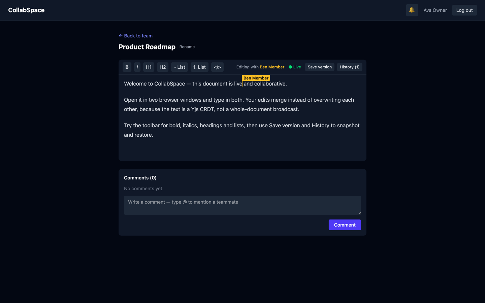
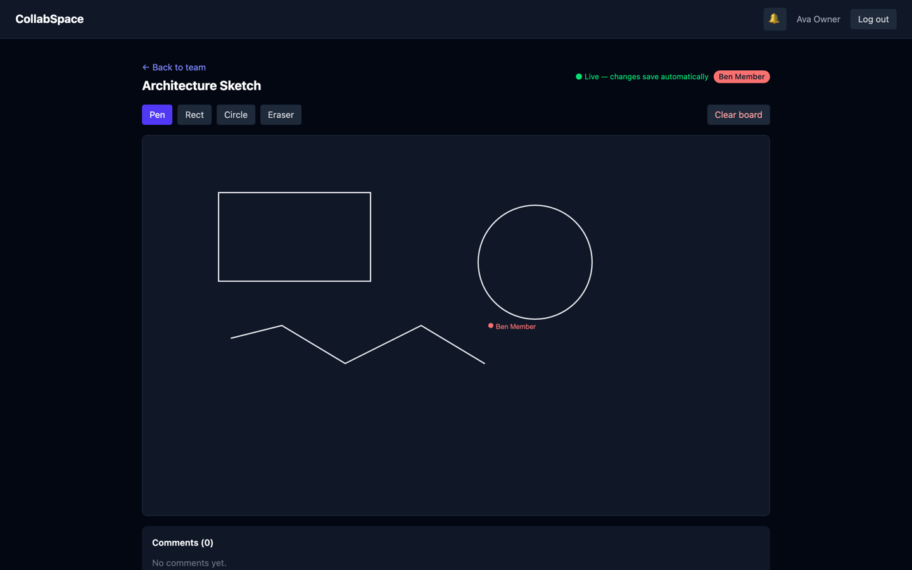
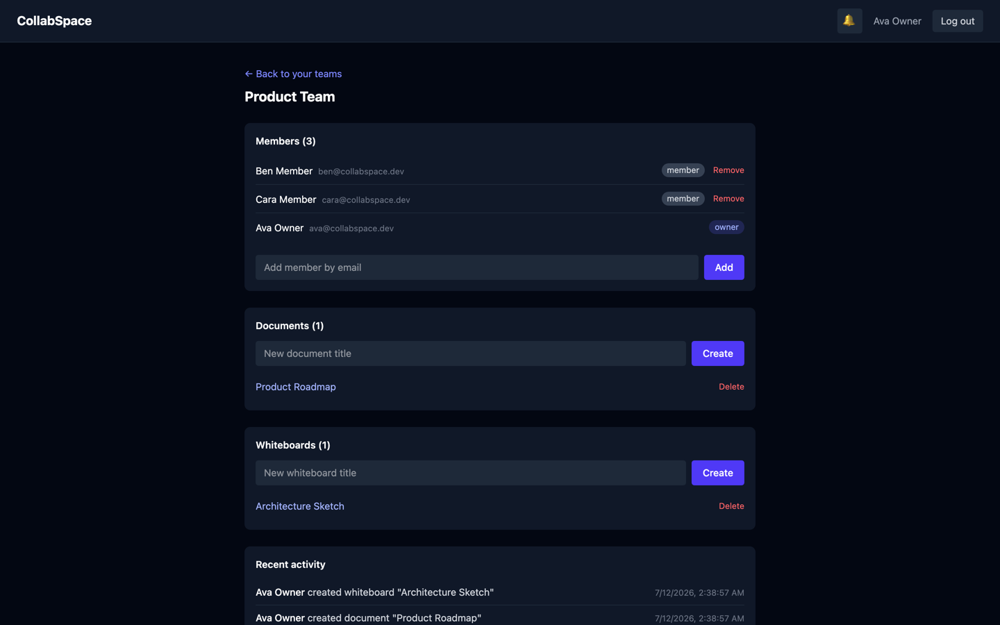
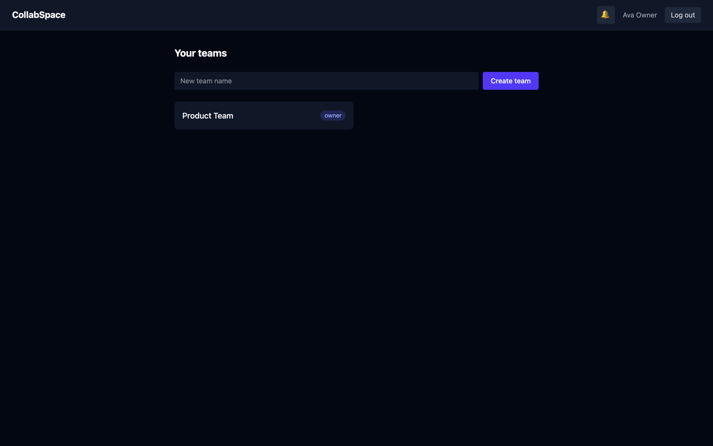
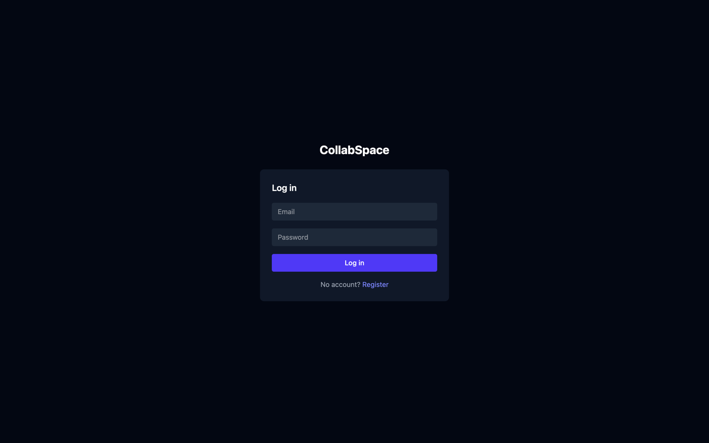

# CollabSpace

A real-time team collaboration app. Teams share rich-text documents that several people can edit at the same time, whiteboards they can draw on together, threaded comments with @mentions, in-app notifications and document version history.

**Live demo:** https://collabspace-mu-sooty.vercel.app

Log in with `ava@collabspace.dev` / `password123` to explore a pre-populated team, or register your own account. The backend runs on Render's free tier, so the first request after some idle time can take up to a minute while the server wakes up.



## Features

- Register/login with JWT auth, bcrypt-hashed passwords
- Teams with per-team roles: the role lives on the user-team membership, so one person can be owner of one team and a plain member of another
- Collaborative rich-text editor (Yjs + Tiptap): concurrent edits merge instead of overwriting, with live cursors and a presence list
- Shared whiteboard (Socket.io + react-konva): pen, rectangle, circle and eraser tools, live cursors, presence badges
- Comments on documents and whiteboards, with one-level replies and @mentions picked from a member list
- In-app notifications for mentions and team invites - pushed live over Socket.io if you're online, stored in MongoDB so they're waiting if you're not
- Document version history: save named snapshots and restore any of them (the current content is snapshotted first, so a restore can always be undone)
- Team activity feed
- Everything persists server-side: documents and boards autosave (debounced) and reload exactly as you left them

## Screenshots

| Shared whiteboard | Team page |
| --- | --- |
|  |  |

| Dashboard | Login |
| --- | --- |
|  |  |

## Tech stack

| Layer | Tech |
| --- | --- |
| Frontend | React 19 (Vite), Tailwind CSS, React Router, Axios |
| Editor | Tiptap + Yjs + y-websocket |
| Whiteboard | react-konva + Socket.io |
| Backend | Node 20, Express 5, Mongoose, Socket.io, ws |
| Database | MongoDB Atlas |
| Hosting | Vercel (client), Render (server) |

## How it works

Express, Socket.io and y-websocket all share **one HTTP server on one port**. WebSocket upgrade requests are routed by path: `/socket.io/*` goes to Socket.io, `/yjs/*` goes to y-websocket. Both transports authenticate with the same JWT the REST API uses - Socket.io in the handshake, y-websocket on the upgrade request (documents also check team membership before the connection is accepted).

Text and drawings need different conflict handling:

- **Document text uses a CRDT (Yjs).** Two people typing into the same paragraph produce concurrent inserts; Yjs merges them deterministically so nothing is lost. The encoded Yjs state is persisted on the document (debounced, plus a final flush when the last editor leaves) and reloaded when the document is opened again.
- **Whiteboard shapes are independent objects**, each with a unique client-generated id, so last-write-wins per shape is enough. The server keeps the live board in memory while people are on it and writes it to MongoDB a few seconds after each change and when the last user leaves.

Versions are separate snapshots of the document content as ProseMirror JSON. Restoring loads a snapshot back into the live editor, so the restore itself syncs to everyone through the shared Yjs document.

## Running locally

You need Node 20+ and a MongoDB database (a free Atlas M0 cluster works).

```bash
git clone https://github.com/tushar4935/collabspace.git
cd collabspace

# install
cd server && npm install
cd ../client && npm install

# environment
cp server/.env.example server/.env    # then set MONGODB_URI and JWT_SECRET
cp client/.env.example client/.env    # defaults work for local dev
```

Environment variables:

| File | Variable | Purpose |
| --- | --- | --- |
| `server/.env` | `MONGODB_URI` | MongoDB connection string |
| `server/.env` | `PORT` | server port (default 4000) |
| `server/.env` | `CLIENT_ORIGIN` | frontend origin for CORS, e.g. `http://localhost:5173` |
| `server/.env` | `JWT_SECRET` | secret for signing JWTs (`openssl rand -hex 32`) |
| `client/.env` | `VITE_SERVER_URL` | backend URL, e.g. `http://localhost:4000` |

Seed demo data (three users, a team, a document with content, a whiteboard with shapes):

```bash
cd server && npm run seed
```

Note: the seed wipes all collections first, so only run it against your own database. All seeded accounts use the password `password123`:

| Email | Role |
| --- | --- |
| `ava@collabspace.dev` | owner |
| `ben@collabspace.dev` | member |
| `cara@collabspace.dev` | member |

Run it (two terminals):

```bash
cd server && npm run dev    # http://localhost:4000
cd client && npm run dev    # http://localhost:5173
```

y-websocket is not a separate process - it shares the server's port.

To see the real-time features, open the same document or whiteboard in a normal window and an incognito window, logged in as two different users.

## Deploying

The backend needs a host that keeps a process alive (WebSockets), so serverless platforms won't work for it.

1. **MongoDB Atlas**: create a cluster and allow access from `0.0.0.0/0` (Render's free tier has no fixed IPs).
2. **Render**: new Web Service from this repo, root directory `server`, build `npm install`, start `npm start`, health check `/api/health`. Set `MONGODB_URI`, `JWT_SECRET` and `CLIENT_ORIGIN` (the exact Vercel URL, no trailing slash). Render sets `PORT` itself.
3. **Vercel**: new project from this repo, root directory `client` (Vite preset). Set `VITE_SERVER_URL` to the Render URL. `client/vercel.json` already contains the SPA rewrite so deep links survive a refresh.
4. Seed the deployed database by running `npm run seed` locally with `MONGODB_URI` pointing at Atlas.

If the browser console shows CORS errors, `CLIENT_ORIGIN` doesn't exactly match the deployed frontend URL.

## Version pinning

The collaboration packages are version-sensitive: all Tiptap packages must be on the same version, and only a single copy of `yjs` may end up in the client bundle (two copies break sync silently). `yjs`, `y-websocket`, `y-protocols` and the Tiptap family are pinned in the package.json files - if you upgrade them, upgrade them together and check `npm ls yjs` still shows one deduped version.
